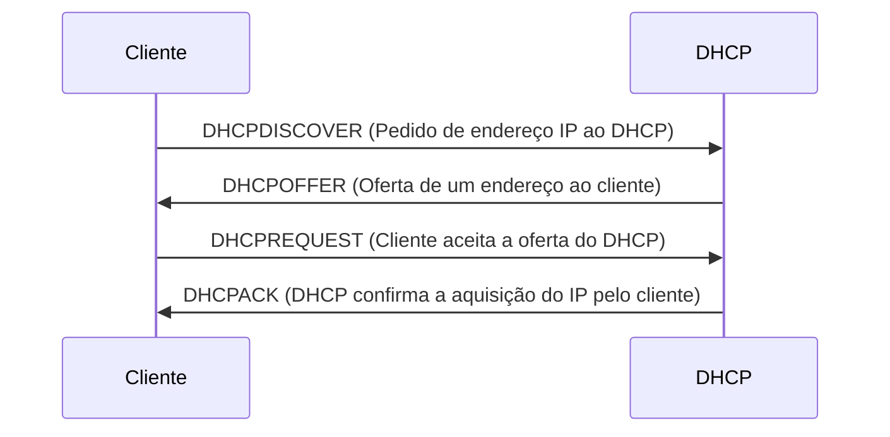

# DHCP

DHCP é um método de distribuição de IP's de forma automatizada, ele funciona em uma forma de aluguel entre o servidor DHCP e o cliente:

### Pontos importantes:

- **Intervalo de IP's:** Intervalo de endereços IP disponíveis que o servidor DHCP pode atribuir aos clientes.
- **Pool de IP's disponíveis:** Conjunto de endereços IP disponíveis dentro de um âmbito DHCP.
- **Faixa de exclusão:** Uma faixa de endereços que não é distribuída pelo servidor DHCP.
- **Tempo de concessão:** É o período de tempo que um IP fica reservado para uma maquina especifica, esse período de concessão é renovado a cada conexão que a maquina cliente faz dentro do período de concessão estipulado, por exemplo: se uma maquina se conecta em uma rede e essa rede tem um tempo de concessão de 4 dias, se a maquina entrar de novo ela irá receber o mesmo IP e renovara o seu período de concessão de 4 dias, caso ele se conecte após o período de 4 dias, ele receberá um IP diferente.
- **Reserva de IP's:** É a possibilidade de fixar nas configurações do servidor DHCP, um IP exclusivo para uma maquina, assim toda vez que essa maquina se conectar a rede, o DHCP irá entregar o mesmo IP para essa maquina, independente do tempo de concessão.
